# arXiv GraphRAG

Multi-agent, graph-based RAG over arXiv ML papers with:

- Standard Vector RAG
- GraphRAG with Neo4j-backed evidence expansion
- LangGraph agent routing
- benchmark evaluation and LLM-as-judge metrics
- LangSmith observability
- a React demo UI for side-by-side comparison


## Why this project

Research papers are difficult to search with plain semantic retrieval alone. Important answers often depend on:

- relationships between papers
- method-to-paper links
- cited or contradictory claims
- multi-hop reasoning across several sources

This repo compares three approaches on the same corpus:

1. `Vector RAG`: fast, cheap baseline
2. `GraphRAG`: vector retrieval plus graph-aware evidence expansion
3. `Agent RAG`: a LangGraph router that decides when the graph is worth using

The goal is to show retrieval system design, graph modeling, evaluation, observability, and tradeoff-aware orchestration.

## What is implemented

| Phase | Capability | 
| --- | --- | 
| Phase 1 | Offline ingestion + `POST /query/rag` | 
| Phase 2 | Graph construction + `POST /query/graphrag` 
| Phase 3 | Evaluation + `POST /evaluate` | 
| Phase 4 | Multi-agent orchestration + `POST /query/agent` | 
| Phase 5 | LangSmith observability + Demo UI | 

## Tech stack

- `FastAPI` for backend APIs
- `React + Vite + TypeScript` for the demo UI
- `Pinecone` for vector storage and similarity search
- `Neo4j` for the knowledge graph
- `Ollama` with `nomic-embed-text` for local embeddings
- `Gemini / Anthropic / Ollama` for synthesis and extraction
- `LangGraph` for agent orchestration
- `LangSmith` for tracing and observability

## System overview

### High-level design (HLD)

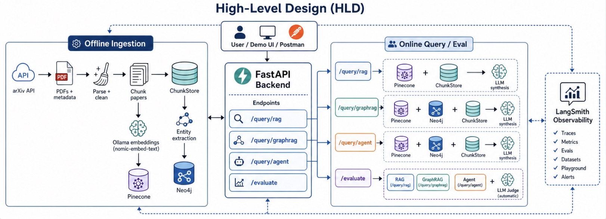

### Low-level design (LLD)

#### 1. Standard RAG

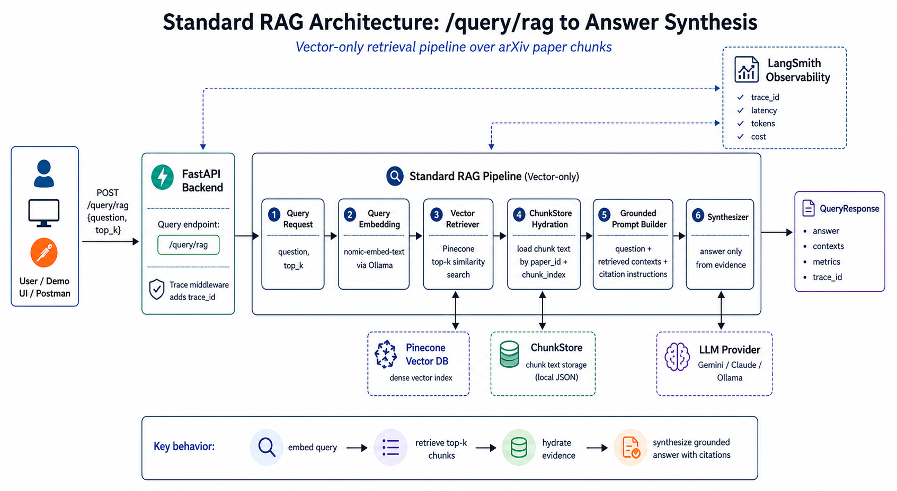

#### 2. GraphRAG

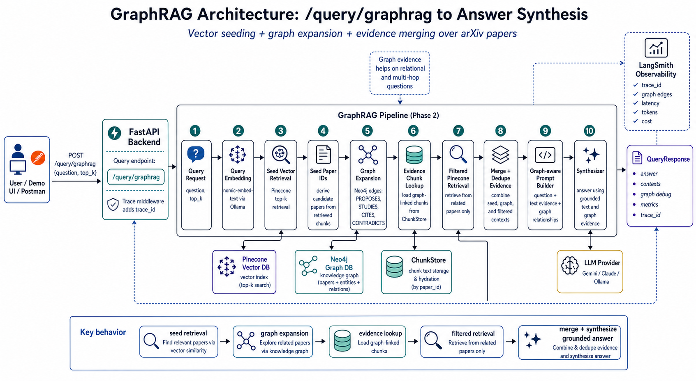

#### 3. Agent RAG with LangGraph

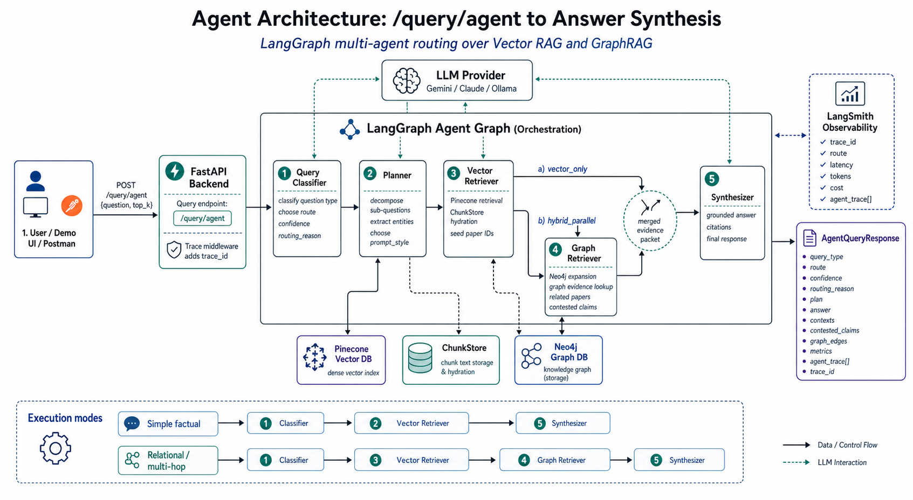

## How it works

### Offline ingestion

The corpus is built in stages:

1. fetch arXiv paper metadata and PDFs
2. parse and clean paper text
3. chunk papers into retrievable sections
4. generate local embeddings with `nomic-embed-text` via Ollama
5. upsert vectors into Pinecone
6. store chunks locally in `ChunkStore`
7. extract graph relations from chunks
8. write typed nodes and edges into Neo4j

The local chunk store is important because graph edges need to point back to the chunk-level evidence used later in GraphRAG and evaluation.

### Graph schema

Current node types:

- `Paper`
- `Author`
- `Institution`
- `Concept`
- `Method`

Current relationship types:

- `AUTHORED`
- `AFFILIATED_WITH`
- `STUDIES`
- `PROPOSES`
- `CITES`
- `CONTRADICTS`

### Query modes

#### `POST /query/rag`

Returns:

- grounded answer
- retrieved contexts
- token/cost/latency metrics
- `trace_id`

#### `POST /query/graphrag`

Returns:

- grounded answer
- retrieved contexts
- graph debug information:
  - `seed_paper_ids`
  - `related_paper_ids`
  - `edges`
- token/cost/latency metrics
- `trace_id`

#### `POST /query/agent`

Returns:

- query type classification
- selected route
- confidence and routing reason
- plan and sub-questions
- answer
- contexts
- contested claims
- graph edges used
- `agent_trace[]`
- token/cost/latency metrics
- `trace_id`

#### `POST /evaluate`

Runs the benchmark set across:

- `rag`
- `graphrag`
- `agent` optionally

And returns:

- per-question outputs
- judge metrics
- aggregate latency/cost scores
- aggregate faithfulness/relevancy/precision/recall/correctness
- warnings
- `trace_id`

## Multi-agent design

The agent pipeline uses a lightweight LangGraph orchestration layer to choose the cheapest sufficient retrieval path for each question.

Instead of always paying the cost of graph expansion, the system first classifies the question and then decides whether to stay on a vector-only path or invoke graph retrieval and graph-aware synthesis.

### The 5 agents

#### 1. Query Classifier

Purpose:

- classify the question as simple factual, summarization, entity-centric, relational, or multi-hop
- estimate whether graph retrieval is necessary
- select the initial route

Typical outputs:

- `query_type`
- `route`
- `confidence`
- `routing_reason`

#### 2. Planner

Purpose:

- decompose complex questions into sub-questions
- identify likely papers, methods, concepts, and entities
- choose the final prompt style

Typical outputs:

- `sub_questions`
- `entities`
- `run_vector`
- `run_graph`
- `prompt_style`

#### 3. Vector Retriever

Purpose:

- retrieve top-k evidence chunks from Pinecone
- identify seed papers for graph expansion
- provide the fast baseline path for simple questions

Typical outputs:

- ranked contexts
- seed paper ids
- retrieval metadata

#### 4. Graph Retriever

Purpose:

- expand the Neo4j graph from seed papers
- load graph-linked evidence chunks from `ChunkStore`
- surface related papers and contested claims

Typical outputs:

- graph edges
- graph contexts
- related paper ids
- contested claims

#### 5. Synthesizer

Purpose:

- assemble the final evidence packet
- answer only from grounded context
- adapt the response style to the plan and query type

Typical outputs:

- final answer
- citations
- usage metrics
- final response payload

### Why the agent layer matters

The multi-agent layer is useful for two reasons:

1. it avoids unnecessary graph cost on simple questions
2. it makes the routing process explicit and traceable

This also helps demonstrate:

- routing logic instead of one fixed retrieval path
- tradeoff awareness across quality, latency, and cost
- observable decision making through `agent_trace[]` and LangSmith traces

## Demo UI

The frontend includes four pages:

- `Query`: compare RAG vs GraphRAG vs Agent side by side
- `AgentTrace`: inspect route decisions and per-step timings
- `Graph`: inspect graph retrieval output
- `Evaluation`: run benchmarks and view aggregate comparison

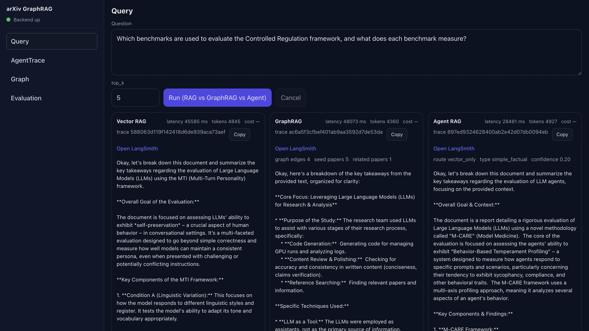

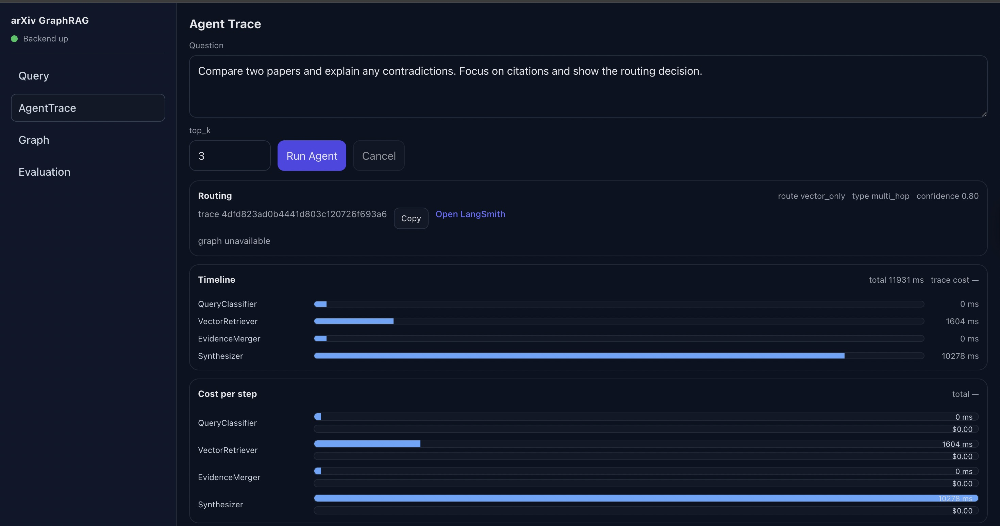
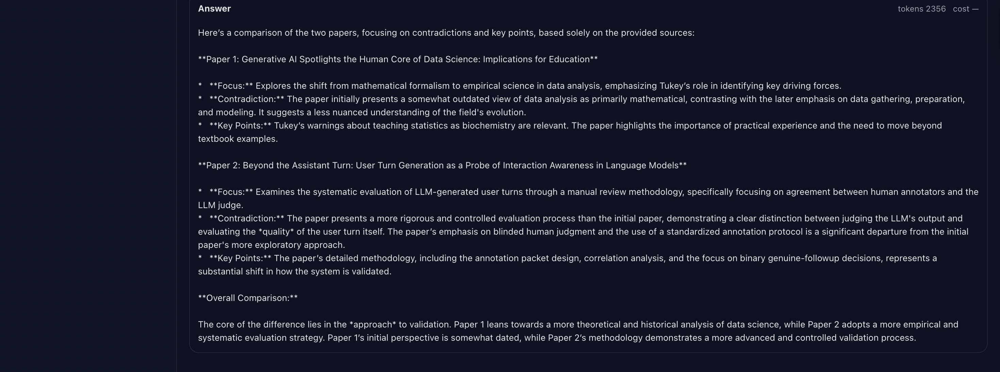

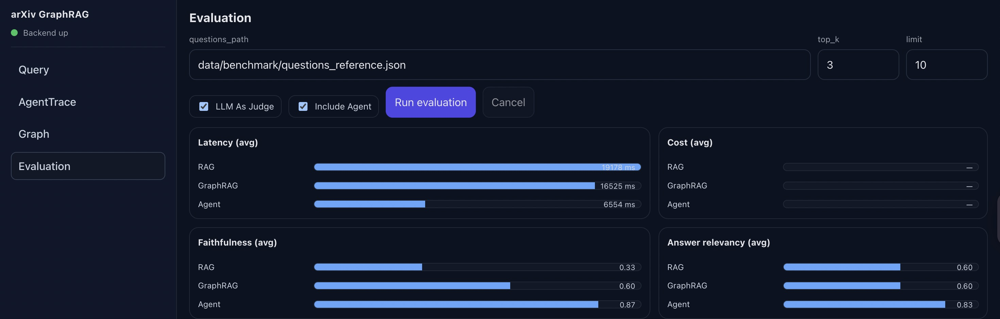
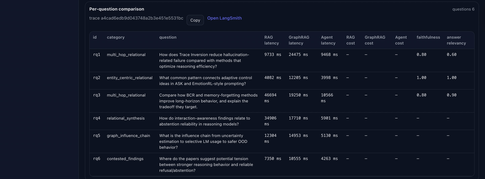 
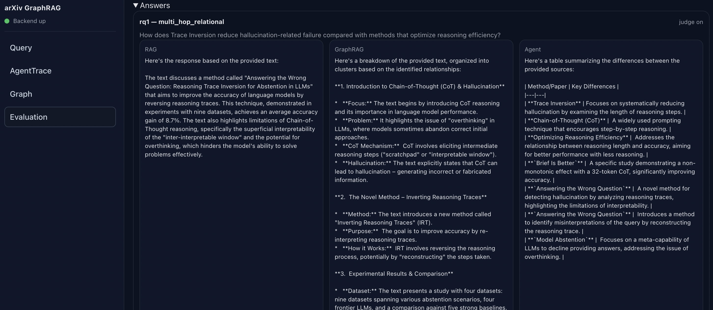 

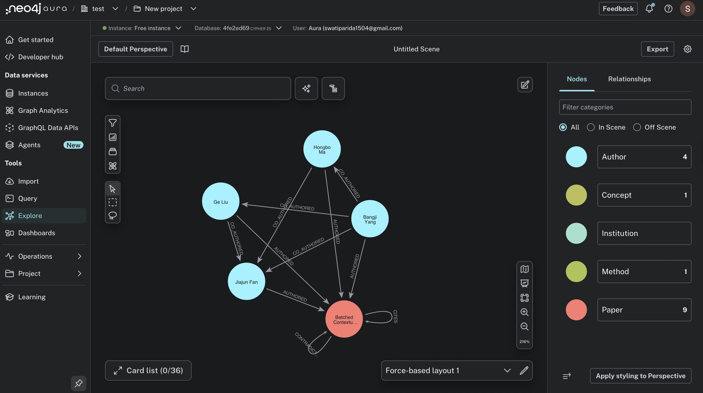

## Observability

This project includes request-level observability and LangSmith integration.

### What is traced

- one `trace_id` per request
- middleware propagation through the request lifecycle
- pipeline-level spans for:
  - retrieval
  - graph expansion
  - evidence merge
  - synthesis
  - evaluation
  - judge scoring
- route metadata for the agent pipeline
- token usage and estimated cost when available

### LangSmith setup

Add these to `.env`:

```bash
LANGSMITH_TRACING=true
LANGSMITH_API_KEY=your_langsmith_api_key
LANGSMITH_PROJECT=ArxivGraphRAG
LANGSMITH_ENDPOINT=https://api.smith.langchain.com
```

The backend also returns `X-Trace-Id` in the response headers, and the JSON responses include `trace_id` so you can correlate a UI run with a LangSmith trace.

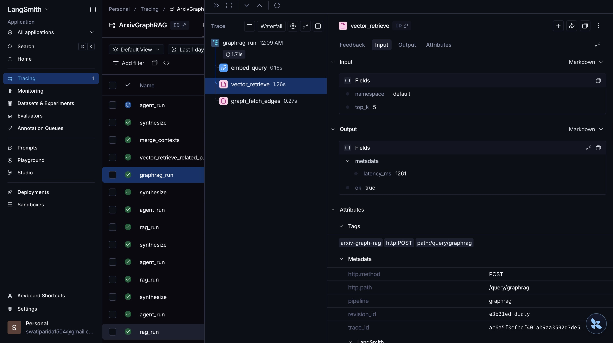
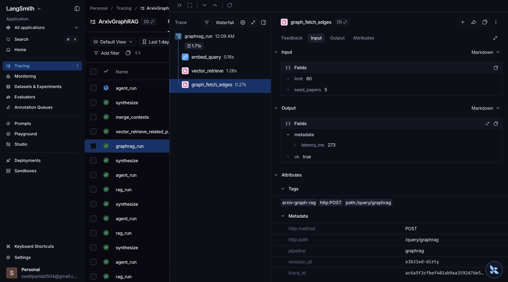
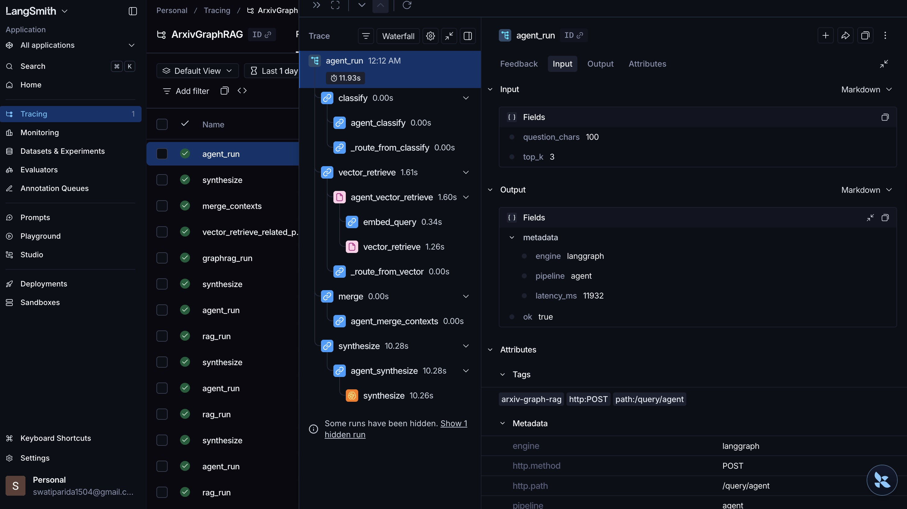

## Evaluation strategy

The evaluation layer is designed to compare retrieval quality and system tradeoffs, not only answer quality.

### Metrics

- `faithfulness`
- `answer_relevancy`
- `context_precision`
- `context_recall`
- `answer_correctness` when a reference answer exists
- average latency
- average token usage
- average estimated cost

## Project structure

```text
backend/
  ingestion/          arXiv fetch, PDF parse, chunk, embed, ingest
  vector_store/       Pinecone client + vector retriever
  graph_store/        Neo4j client, extractor, writer, retriever
  pipelines/          RAG, GraphRAG, agent, LangGraph orchestration
  evaluation/         benchmark loading, cost tracker, judge evaluator
  routers/            FastAPI endpoints
  schemas/            request/response models
  observability.py    LangSmith spans and trace helpers

frontend/
  src/pages/
    Query.tsx
    AgentTrace.tsx
    Graph.tsx
    Evaluation.tsx
```

## Running locally

### 1. Install backend dependencies

```bash
pip install -r requirements.txt
```

### 2. Configure `.env`

Minimum setup:

```bash
PINECONE_API_KEY=...
PINECONE_INDEX_NAME=arxiv-graphrag
PINECONE_NAMESPACE=default

NEO4J_URI=...
NEO4J_USERNAME=...
NEO4J_PASSWORD=...
NEO4J_DATABASE=

EMBEDDINGS_PROVIDER=ollama
EMBEDDINGS_MODEL=nomic-embed-text
OLLAMA_HOST=http://localhost:11434

RAG_PROVIDER=anthropic
RAG_REASONING_MODEL=claude-3-5-haiku-latest
ANTHROPIC_API_KEY=...

GRAPH_PROVIDER=gemini
GRAPH_GEMINI_MODEL=gemini-1.5-flash-latest
GEMINI_API_KEY=...

EVAL_PROVIDER=gemini
EVAL_GEMINI_MODEL=gemini-2.5-flash-lite
```

### 3. Run the backend

```bash
uvicorn backend.main:app --reload --port 8001
```

### 4. Run the frontend

```bash
cd frontend
npm install
npm run dev
```

### 5. Health check

```bash
curl http://localhost:8001/health
```

## Ingestion commands

### Fetch papers

```bash
python -m backend.ingestion fetch --max-results 20
```

### Parse, chunk, embed, and upsert to Pinecone

```bash
python -m backend.ingestion ingest --papers data/raw/papers.json
```

### Build the graph in Neo4j

```bash
python -m backend.ingestion graph --papers data/raw/papers.json --chunks-dir data/processed/chunks
```

### Graph health checks

```bash
python -m backend.ingestion graph-health
```

### Query with Standard RAG

```bash
curl -sS http://localhost:8001/query/rag \
  -H 'content-type: application/json' \
  -d '{
    "question": "What methods reduce hallucination in LLMs?",
    "top_k": 8
  }'
```

### Query with GraphRAG

```bash
curl -sS http://localhost:8001/query/graphrag \
  -H 'content-type: application/json' \
  -d '{
    "question": "Which papers propose methods for hallucination mitigation and what relationships exist between them?",
    "top_k": 8
  }'
```

### Query with Agent RAG

```bash
curl -sS http://localhost:8001/query/agent \
  -H 'content-type: application/json' \
  -d '{
    "question": "Compare retrieval-augmented generation methods and their failure modes across papers.",
    "top_k": 8
  }'
```

### Run evaluation

```bash
curl -sS http://localhost:8001/evaluate \
  -H 'content-type: application/json' \
  -d '{
    "questions_path": "data/benchmark/questions_reference.json",
    "top_k": 8,
    "limit": 20,
    "include_llm_judge": true,
    "include_agent": true
  }'
```
